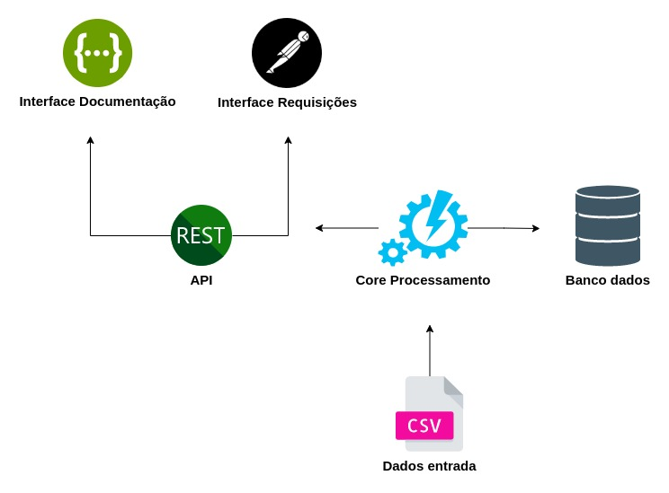
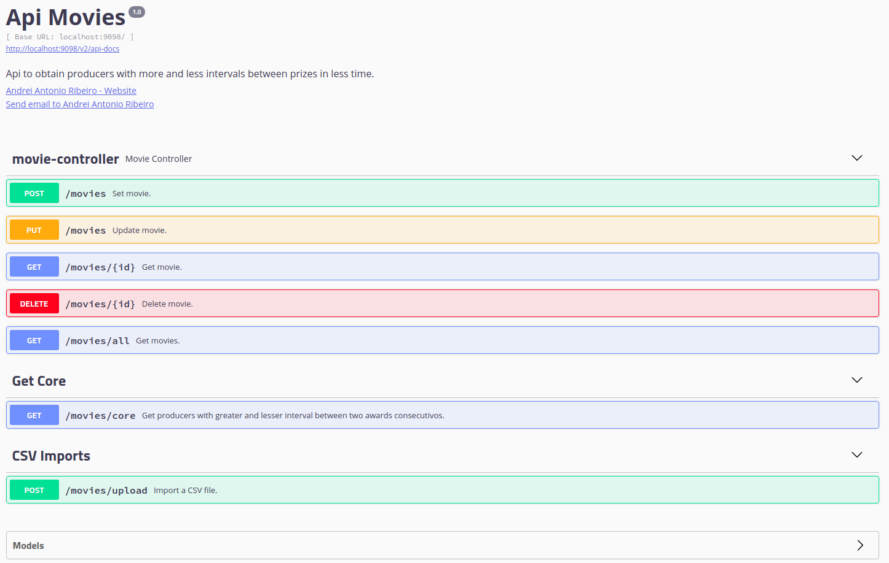

# Api List Movies

Este projeto tem como objetivo realizar o CRUD de filmes e obter o(s) produtor(s) com maior intervalo entre dois prêmios consecutivos, e o que obteve dois prêmios mais rápido.

O serviço é executado com SpringBoot e conta com endpoint's RestFull, testes de integração com MockMvc, persistência de dados com JPA, e documentação de api com Swagger.

Os dados são salvos em memória no banco H2, e podem ser acessados pela url http://localhost:9098/h2-console/

É possível carregar os dados no sistema passando como parametro arquivo CSV (não é obrigatório), ou mesmo realizando upload via endpoint da API.

#### 1) Formas de execução do sistema e testes de integração.

   ##### Executar com Maven 
   > mvn spring-boot:run

   ##### Executar com Jar <code> java -jar listMovies-0.0.1-SNAPSHOT.jar listMovies.csv</code>

   ##### Executar com Docker image  <code> java -jar listMovies-0.0.1-SNAPSHOT.jar listMovies.csv</code>

   ##### Executar testes integração <code> mvn test</code>

#### 2) Arquitetura de funcionamento do sistema.

#### 3) Interface de documentação
<code> http://localhost:9098/swagger-ui.html#/</code>

