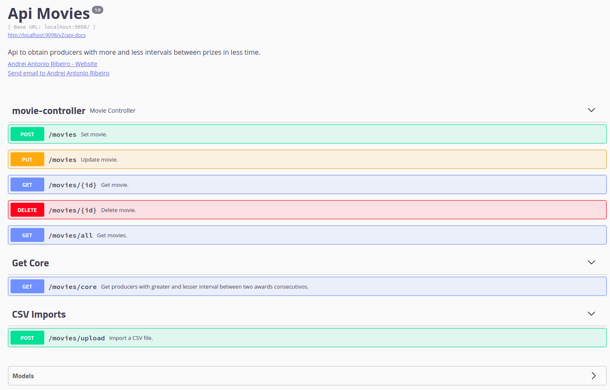

# Api cadastro de filmes

Este projeto tem como objetivo realizar o CRUD de filmes e obter o(s) produtor(s) com maior intervalo entre dois prêmios consecutivos, e o que obteve dois prêmios mais rápido.

O serviço conta com endpoint's RestFull, testes de integração com MockMvc, persistência de dados com JPA, e documentação de api com Swagger.

#### 1) Formas de execução do sistema e testes de integração.

##### Executar com maven
<code> mvn spring-boot:run</code>

##### Executar Jar
<code> java -jar listMovies-0.0.1-SNAPSHOT.jar [file.csv](file.csv)</code>

##### Executar testes
<code> mvn test</code>

#### 2) Arquitetura de funcionamento do sistema.

#### 3) Interface de documentação
<code> http://localhost:9098/swagger-ui.html#/movie-controller</code>

